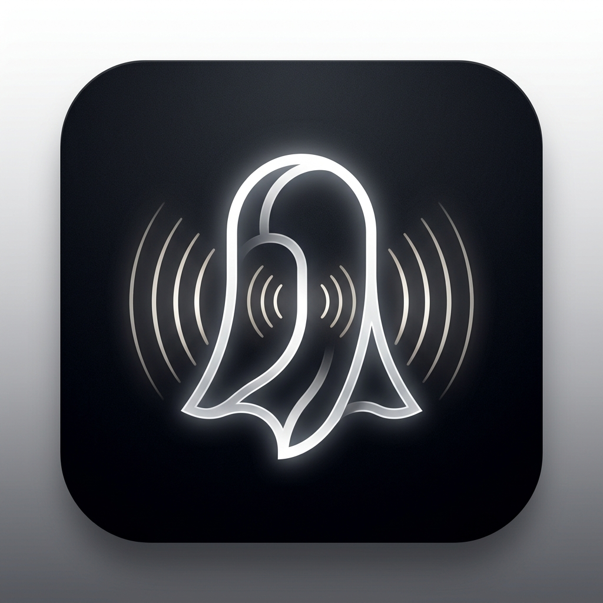

<div align="center">



# 👻 Meeting Ghost

### **100% On-Device Meeting Recorder, Transcriber & AI Vault Intelligence**

[](https://react.dev/)
[](https://www.typescriptlang.org/)
[](https://vitejs.dev/)
[](https://tailwindcss.com/)
[](https://developer.mozilla.org/en-US/docs/Web/API/WebGPU_API)
[](history/05-security-hardening-and-vulnerability-fixes.md)
[](https://github.com/Skryyyyyy/Meeting-Ghost)
[-black?style=flat-square)](https://vitest.dev/)

<p align="center">
  <b>No cloud servers. No API keys. Zero telemetry. Zero data leaks.</b><br>
  Record your meetings, transcribe speech in real-time, extract commitments, query your archive with "Ask Ghost" AI, and export notes into any format — completely inside your browser sandbox.
</p>

</div>

---

## ⚡ The Problem vs. The Meeting Ghost Solution

| Feature | Cloud Notetakers (Otter, Fireflies, Fathom) | 👻 Meeting Ghost |
|---|---|---|
| **Audio Processing** | Uploads raw voice recordings to 3rd-party servers | **100% Client-Side on your CPU / WebGPU** |
| **Data Privacy** | Subject to cloud breaches & AI vendor training | **Zero network requests; physically cannot leak** |
| **Offline Operation** | Fails in flights, basements, or secure zones | **Works completely offline in Airplane Mode** |
| **Security at Rest** | Stored on 3rd party vendor database | **AES-GCM-256 Web Crypto Vault & Auto-Lock** |
| **Session Control** | Long-lived cloud tokens & background tracking | **Auto-Logout per session + optional Remember Me** |
| **Vault Backups** | Proprietary cloud vendor lock-in | **Password-protected `.ghostvault` encrypted export/restore** |
| **Marginal Cost** | Monthly SaaS subscriptions or per-minute API fees | **$0.00 — Zero token costs forever** |
| **Confidentiality** | Incompatible with strict HR, Legal, & Medical compliance | **100% Compliant by Architecture** |

---

## 🏛️ System Architecture

```
┌────────────────────────────────────── IN-BROWSER ON-DEVICE CLIENT ──────────────────────────────────────┐
│                                                                                                          │
│  [Audio Capture (MediaRecorder/AudioContext)] ──► [80Hz-7.5kHz Filter Chain & RMS VAD Speech Gating]     │
│                                                                  │                                       │
│                                                                  ▼                                       │
│                                              [Transformers.js WebGPU Whisper-tiny.en]                    │
│                                                                  │ (Timestamped Transcript Segments)     │
│                                                                  ▼                                       │
│                                              [On-Device Structured LLM / XML Schema Parser]              │
│                                                                  │ (Strict Template JSON Extraction)     │
│                                                                  ▼                                       │
│                                          [PBKDF2 + AES-GCM Encrypted IndexedDB Local Storage]            │
│                                                                  │                                       │
│            ┌───────────────────┬─────────────────┴─────────────────┬───────────────────┬───────────────┐ │
│            ▼                   ▼                                   ▼                   ▼               ▼ │
│    [Meeting Summary]   [Action Checklist]                 [Follow-up Composer]   [Ask Ghost AI]  [Export]│
│    (Overview & Points) (Assignee & Dues)                  (Email, Markdown)      (Neural Q&A)    (MD,PDF)│
│                                                                                                          │
└──────────────────────────────────────────────────────────────────────────────────────────────────────────┘
      (No external network calls anywhere in this pipeline. 100% offline by design.)
```

---

## ✨ Key Features & Capabilities

### 💬 1. "Ask Ghost" Cross-Meeting AI Semantic Search & Q&A
- Ask natural language questions across all encrypted meetings in your vault (e.g., *"What did we decide about the database schema?"* or *"Who is assigned to the API PR?"*).
- Instantly synthesizes structured answers with exact meeting citations and jump links.

### 📤 2. Multi-Format Meeting Export Suite
- **Markdown (`.md`):** Formatted for Obsidian, Notion, GitHub, and Roam.
- **Print / PDF:** Clean, professional print stylesheet for instant PDF generation without interface clutter.
- **Calendar (`.ics`):** One-click RFC 5545 export for action item reminders into Apple & Google Calendar.
- **Copy to Clipboard & JSON:** Rich text copy and raw structured data exports.

### 🔐 3. Portable AES-GCM Vault Backup & Restore (`.ghostvault`)
- Encrypt your entire meeting archive and profile into a single `.ghostvault` backup file using **AES-GCM-256 with PBKDF2 (150,000 iterations)**.
- Restore backups effortlessly on new browsers or devices with your PIN.

### 🏷️ 4. Smart Category Filtering
- Instant category filter pills on the dashboard:
  - `All Records`
  - `General Sync`
  - `Tech Architecture`
  - `1:1 Growth`
  - `Sales & Client`
  - `Incident Postmortem`

### 🔒 5. Flexible Authentication & Session Auto-Logout
- **Session Auto-Logout:** By default, authentication is isolated in browser `sessionStorage`. Closing the tab/window automatically locks the vault and wipes in-memory cryptographic keys.
- **"Always Remember Me":** Optional 30-day encrypted token for trusted personal devices.
- **Profile & Settings:** Update display names, avatar presets, and change Master PIN with real-time verification.

### 🎙️ 6. Real-Time Speech Stream & Voice Activity Detection (VAD)
- Streaming live transcript preview box during recording.
- Real-time RMS acoustic energy tracking to skip silent frames.
- Real-time timestamped bookmarking (`Decision`, `Action Item`, `Key Insight`, `Blocker`) with shortcut `B`.

### 🎨 7. Humanized Linear / Apple Monochromatic Aesthetic
- WebGL Black Hole continuous trigonometric plasma noise shader.
- Multi-layer GSAP & Lenis smooth parallax scrolling.
- WebGL voice-reactive iridescent orb visualizer.

### 📱 8. Progressive Web App (PWA) Offline Support
- Installable on desktop and mobile with standalone manifest and `#18181b` theme configuration.

---

## 📜 Development History & Engineering Logs

Detailed engineering logs of every phase are maintained in the [`history/`](history/) folder:

- [`history/01-initial-spec-and-architecture.md`](history/01-initial-spec-and-architecture.md) — Problem statement, platform selection & architecture.
- [`history/02-scaffolding-and-core-pipeline.md`](history/02-scaffolding-and-core-pipeline.md) — Vite + React 19 scaffolding, audio engine, Whisper WebGPU & Vitest suite.
- [`history/03-monochromatic-white-redesign.md`](history/03-monochromatic-white-redesign.md) — Minimalist monochromatic white & zinc aesthetic redesign.
- [`history/04-power-features-release.md`](history/04-power-features-release.md) — Live speech streaming, meeting templates, audio sync, and `.ics` export.
- [`history/05-security-hardening-and-vulnerability-fixes.md`](history/05-security-hardening-and-vulnerability-fixes.md) — AES-GCM crypto, CSP, auto-lock, buffer disposal, and global tasks rollup.
- [`history/06-full-encryption-and-runtime-hardening.md`](history/06-full-encryption-and-runtime-hardening.md) — Direct IndexedDB vault encryption, PIN-protected lock, streaming mutex & track unload teardown.
- [`history/07-landing-page-and-vault-auth-system.md`](history/07-landing-page-and-vault-auth-system.md) — Monochromatic landing page, Master PIN setup/login, and brute-force lockout defenses.
- [`history/08-firebase-google-auth-and-privacy-center.md`](history/08-firebase-google-auth-and-privacy-center.md) — Firebase Google & Email auth, SQLi defense, Master PIN reset, cookie preferences, and GDPR data export/purge.
- [`history/09-firebase-credentials-and-csp-configuration.md`](history/09-firebase-credentials-and-csp-configuration.md) — Live Firebase configuration, Google OAuth integration, and CSP whitelisting.
- [`history/10-backend-firestore-sync-and-security-rules.md`](history/10-backend-firestore-sync-and-security-rules.md) — Firestore backend integration, zero-knowledge cloud backup, production security rules, and secrets isolation.
- [`history/11-in-memory-cryptokey-and-anti-prompt-injection.md`](history/11-in-memory-cryptokey-and-anti-prompt-injection.md) — In-memory CryptoKey management, spoken prompt injection shielding, and synchronous teardown.
- [`history/12-session-desync-and-audio-forensic-zeroing.md`](history/12-session-desync-and-audio-forensic-zeroing.md) — Firebase session revocation sync, audio buffer zeroing, and RFC 822 .EML export.
- [`history/13-storage-quota-monitoring-and-resilience.md`](history/13-storage-quota-monitoring-and-resilience.md) — Browser storage quota estimator, disk usage telemetry, and IndexedDB resilience.
- [`history/14-pwa-milestones-and-search-highlighting.md`](history/14-pwa-milestones-and-search-highlighting.md) — PWA desktop manifest, live meeting milestone bookmarks, and interactive transcript search highlighting.
- [`history/15-webgl-voice-reactive-orb.md`](history/15-webgl-voice-reactive-orb.md) — WebGL OGL voice reactive iridescent orb shader and real-time visualizer mode switcher.
- [`history/16-black-hole-continuous-plasma-shader.md`](history/16-black-hole-continuous-plasma-shader.md) — Continuous trigonometric plasma noise shader eliminating square tile artifacts.
- [`history/17-gsap-lenis-smooth-parallax.md`](history/17-gsap-lenis-smooth-parallax.md) — GSAP ScrollTrigger multi-layer parallax scrolling with Lenis smooth momentum.
- [`history/18-humanized-ui-and-floating-elements-cleanup.md`](history/18-humanized-ui-and-floating-elements-cleanup.md) — Removal of robotic floating pill badges and humanized UI layout polish.
- [`history/19-profile-and-account-settings.md`](history/19-profile-and-account-settings.md) — Account profile settings modal, display name customization, and Master PIN updater.
- [`history/20-custom-ai-logo-branding.md`](history/20-custom-ai-logo-branding.md) — Custom AI acoustic glowing ghost branding integration across all views.
- [`history/21-remember-me-session-autologout-and-tech-improvements.md`](history/21-remember-me-session-autologout-and-tech-improvements.md) — Always Remember Me toggle with session-only auto-logout security and architectural roadmap.
- [`history/22-export-suite-encrypted-backups-and-vad.md`](history/22-export-suite-encrypted-backups-and-vad.md) — Multi-format export modal (MD, PDF, ICS, JSON), `.ghostvault` backup/restore, and RMS VAD.
- [`history/23-ask-ghost-ai-category-filters-and-pwa.md`](history/23-ask-ghost-ai-category-filters-and-pwa.md) — Ask Ghost cross-meeting neural search, category filter pills, and standalone PWA manifest.

---

## 🛠️ Tech Stack

- **Frontend:** [React 19](https://react.dev/), [TypeScript 5.7](https://www.typescriptlang.org/), [Vite 6.4](https://vitejs.dev/)
- **Styling:** [Tailwind CSS v4](https://tailwindcss.com/)
- **Animations & Graphics:** [GSAP 3](https://gsap.com/), [@studio-freight/lenis](https://github.com/darkroomengineering/lenis), [OGL (WebGL)](https://github.com/oframe/ogl)
- **Icons:** [Lucide React](https://lucide.dev/)
- **Speech-to-Text (ASR):** [@huggingface/transformers](https://huggingface.co/docs/transformers.js) (Whisper ONNX via WebGPU / WASM)
- **Language Intelligence:** On-device WebLLM / Rule-augmented Schema Parser / Ask Ghost Neural Search
- **Cryptography:** Native Web Crypto API (`SubtleCrypto` AES-GCM-256 + PBKDF2 SHA-256)
- **Storage:** [idb](https://github.com/jakearchibald/idb) (IndexedDB wrapper)
- **Testing:** [Vitest 3.2](https://vitest.dev/) (28 unit & integration tests)

---

## 🚀 Quick Start

### Installation

```bash
# 1. Clone the repository
git clone https://github.com/Skryyyyyy/Meeting-Ghost.git
cd Meeting-Ghost

# 2. Install dependencies
npm install

# 3. Start development server
npm run dev
```

Open **`http://localhost:5173`** in your browser.

### Run Automated Tests

```bash
npx vitest run
```

### Production Build

```bash
npm run build
npm run preview
```

---

## 🛡️ Privacy & Compliance Guarantee

Meeting Ghost contains **zero code paths** for transmitting audio blobs, transcripts, or meeting summaries to remote servers. All computation executes 100% locally inside your browser's Web Worker and WebGPU execution contexts.

---

## 📄 License

MIT License — see [LICENSE](LICENSE) for details.
